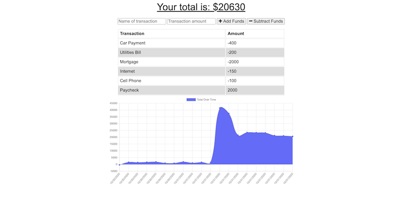

# BudgetTracker

## Introduction
This is a budget tracker PWA which allows users to track expenses with the ability to access functionality while offline.
 

 
Gif of app functionality

 

## Technologies used
* HTML
* CSS
* JavaScript
* Express
* NodeJS
* MongoDB
* Mongoose

 

## Usage
Using the budget tracker PWA application, users are able to add expenses and deposits to their budget either online or offline. Offline functionality includes the ability to enter deposits and expenses which will be added to the tracker when brought back online. The application also includes a chart for visual representation of deposits and expenses as well as a table showing the six most recent transactions. A video demonstration of the functionality of the application can be found [here](https://youtu.be/ofnbPFjNUOY).

 

## Screenshots

 
Screenshot of application
 
 

## Contact Information
If you have any questions about the application or contributions, I can be contacted via email at: <maynperalta@gmail.com>
 
